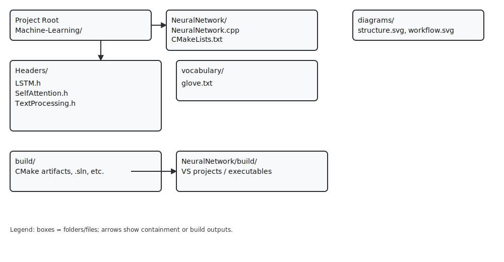

# Machine-Learning

This repository contains a small C++ neural network project (`NeuralNetwork`) focused on text processing, with LSTM and self-attention components and a CMake-based build structure. The project is intended as an educational/demo codebase to explore sequence models and attention mechanisms in C++.

**Important paths:**
- **Project root**: `.`
- **Main source**: `NeuralNetwork/NeuralNetwork.cpp`
- **Headers**: `NeuralNetwork/Headers/` (`LSTM.h`, `SelfAttention.h`, `TextProcessing.h`)
- **Vocabulary / embeddings**: `NeuralNetwork/vocabulary/glove.txt`
- **Build outputs**: `build/` and `NeuralNetwork/build/`
- **Diagrams**: `diagrams/structure.svg`, `diagrams/workflow.svg`

**Summary**

This repository demonstrates a minimal text-processing neural network implemented in C++ with modular components for preprocessing, embedding lookup (GloVe-style vectors included under `vocabulary/`), a recurrent LSTM layer, and a self-attention block. The codebase is organized for clarity and extension rather than production performance.

This is a research-focused project: it is intended to help developers and researchers study and experiment with the backend implementation details of modern LLMs and Transformer-style models (how tokenization, embeddings, recurrence/attention, batching and masking, and inference pipelines work at the code level). It is not a production LLM; instead it is a learning and exploration tool for understanding architectural and implementation trade-offs.

**Repository Structure (high level)**

- `NeuralNetwork/`
  - `NeuralNetwork.cpp` — Entry point; orchestrates loading data, model initialization, and inference/training loops (if present).
  - `CMakeLists.txt` — CMake configuration for generating build systems (Visual Studio, Makefiles, etc.).
  - `Headers/`
    - `LSTM.h` — LSTM layer implementation or interface (hidden/cell state handling, forward pass).
    - `SelfAttention.h` — Self-attention mechanism implementation (scaled dot-product attention, masking).
    - `TextProcessing.h` — Tokenization, vocabulary mapping, padding/masking utilities.
  - `vocabulary/`
    - `glove.txt` — Pretrained word vectors (plain text file with format: `word val1 val2 ...`).

- `build/` and `NeuralNetwork/build/` — CMake-generated build artifacts (Visual Studio solution and projects on Windows).



**Component details**

- `TextProcessing` (via `TextProcessing.h`)
  - Responsibilities: read text, normalize (e.g., lowercase), tokenize, map to indices, pad/truncate sequences, and create attention/mask tensors.
  - Embedding loading: a function should load `glove.txt` into a mapping `string -> vector<float>`; handle OOV tokens by a random initialization or a special vector (e.g., zero or small-random).

- `LSTM` (via `LSTM.h`)
  - Responsibilities: implement the standard LSTM gating equations, maintain hidden and cell states, compute forwards for sequences. API typically includes `forward(input_sequence) -> outputs` and `reset_state()`.

- `SelfAttention` (via `SelfAttention.h`)
  - Responsibilities: compute Q, K, V projections, scaled dot-product attention, apply masks to ignore padded tokens, and output context-enhanced embeddings.

**Typical Data & Model Workflow**

1. Raw text input (file or string) is ingested.
2. `TextProcessing` tokenizes and maps words to indices.
3. Embeddings for tokens are retrieved from `vocabulary/glove.txt` and assembled into batched tensors.
4. Sequences are padded/truncated to fixed length and a mask is produced for padded positions.
5. The model processes embeddings via LSTM layers, then passes outputs to the Self-Attention block (or vice-versa depending on design) to produce context-aware representations.
6. A task-specific head (classification/regression) produces final outputs; postprocessing converts logits to labels or numeric outputs.


**Build Instructions (Windows — PowerShell, and cross-platform notes)**

Prerequisites:
- Visual Studio with C++ tooling (2017/2019/2022) or another MSVC-enabled toolchain for Windows
- CMake 3.15+ (this repo includes artifacts from CMake 3.31.x but works with 3.15+)

Recommended quick build (out-of-source) — PowerShell / Windows using default generator (Visual Studio):

```powershell
cd .\NeuralNetwork
Remove-Item -Recurse -Force build -ErrorAction SilentlyContinue
mkdir -Force build; cd build
# Generate (default Visual Studio generator on Windows):
cmake ..
# Build Debug config:
cmake --build . --config Debug
# Or build Release config:
cmake --build . --config Release

# Example executable path (Debug):
# .\NeuralNetwork\build\Debug\NeuralNetwork.exe
```

Explicit generator examples:
- Use Visual Studio generator with specific architecture (e.g., x64):
```powershell
cmake -G "Visual Studio 16 2019" -A x64 ..
cmake --build . --config Release
```
- Use Ninja (single-config generator) if you have Ninja installed:
```powershell
cmake -G "Ninja" ..
cmake --build . --config Release
```

Cross-platform notes (Linux / macOS):
- On Unix-like systems you can use the Unix Makefiles or Ninja generator. Example (bash):
```bash
mkdir -p build && cd build
cmake -G "Unix Makefiles" ..
cmake --build . --config Release
```
- When using single-config generators (Makefiles/Ninja), set `CMAKE_BUILD_TYPE` at configure time for a default build type:
```bash
cmake -DCMAKE_BUILD_TYPE=Release ..
cmake --build .
```

---
Both SVGs are vector graphics, viewable in browsers and editors. If you want PNGs as well, I can add them.

**Extending the project**

- Add training: implement backward passes or integrate a library for autodiff; add optimizer and checkpointing.
- Add evaluation: add scripts to compute metrics on datasets and produce confusion matrices.
- Improve tokenization: add more advanced tokenizers or use third-party NLP tokenization libraries.

**Contributing**

- Fork, create a branch, implement changes, and open a pull request with a description and tests/examples.

**License**

Refer to the `LICENSE` file in the repository root.

---

for vocabulary i have used glove vector txt where you can find it
```link
-> https://drive.google.com/file/d/1jutIkEKx54vMSya0we5F__EBhi8Cqez5/view?usp=drive_link
```


**Quick Build Summary (Windows / PowerShell)**
```
cd NeuralNetwork
cd build
cmake .
cmake --build .
```

